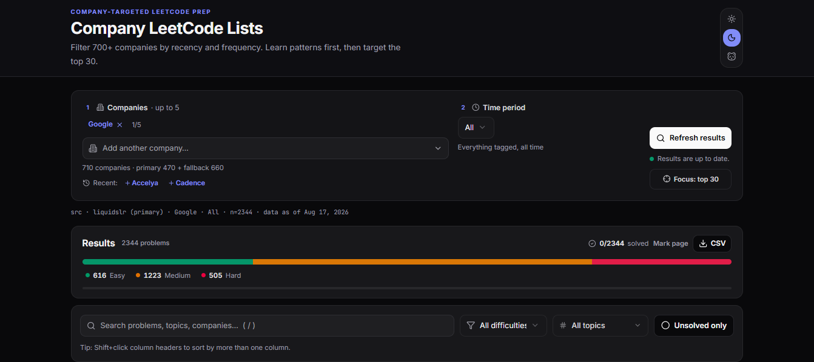

# Company LeetCode Lists

Pick up to 5 companies, filter by recency and frequency, and prep against what
they actually ask. Company-tagged questions across 700+ companies, with sortable
stats, topic filters, per-company compare view, solved tracking, Top-30 focus
mode, CSV export, and Light / Dark / Panda themes. Every view is a shareable link.



> Frequency means "how often this is tagged for *that* company" (100 = its most-asked),
> not a hiring probability. Tags are user-reported, so small-company lists are noisy.
> Not affiliated with LeetCode.

## Developers

```bash
bun install && bun run dev      # http://localhost:3000
bun run test && bun run lint    # vitest + eslint
bun run build                   # production build (Next 16 + Turbopack)
```

- `bun.lock` is the only lockfile. CI runs install → typecheck → lint → test → build.
- Data comes from two upstream CSV datasets (primary + fallback), normalized in
  `lib/sources.ts` with quota-friendly caching (ETag revalidation, dedup, honest 429s).
- Key files: `app/page.tsx` (server entry) · `app/components/HomeClient.tsx`
  (controls + state) · `app/components/ProblemTable.tsx`
  (table, filters, sorting) · `lib/merge.ts` (multi-company merge) · `lib/theme.ts`.

Forks and PRs welcome. Please keep `bun run build` green.
